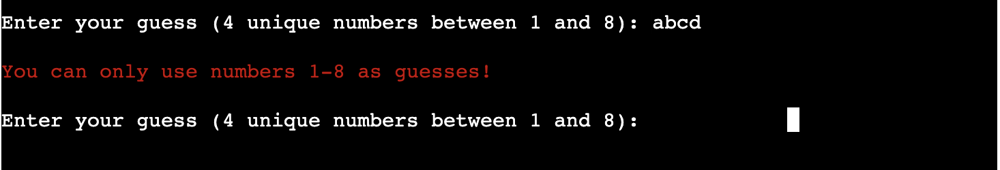

# **ENIGMA**
<h1 id="top"><a href="https://enigma-code-breaker.herokuapp.com/">ENIGMA CODE BREAKER</a></h1>

## Contents
<ul>
    <li>
        <a href="#Introduction"><strong>Introduction</strong></a>
    </li>
    <li>
        <a href="#UX"><strong>UX</strong></a>               
    </li>
    <li>
        <a href="#Technologies"><strong>Technologies</strong></a>
    </li>
    <li>
        <a href="#Features"><strong>Features</strong></a>
    </li>
    <li>
        <a href="#Testing"><strong>Testing</strong></a>   
    </li>
    <li>
        <a href="#Deployment"><strong>Deployment</strong></a>
    </li>
    <li>
       <a href="#Credits"><strong>Credits</strong></a> 
    </li>
    <li>
        <a href="#Screenshots"><strong>Screenshots</strong></a>
    </li>
    <li>
        <a href="#References"><strong>References</strong></a>
    </li>
</ul>

# Introduction

ENIGMA - Code Breaking Game, is a Python terminal game that runs on Heroku.

This game is losely based on the board game of [Mastermind]( https://en.wikipedia.org/wiki/Mastermind_(board_game)) from the 1970s.

### Demo
A live version of the game can be found <a href="https://enigma-code-breaker.herokuapp.com/">**HERE**</a>  
  
<a href="#top">Back to the top.</a>

## How To Play

ENIGMA gameplay, players try to crack the ENIGMA code randomly chosen by the computer. Players are given hints generated by the computer after every attempt to try to logically deduce what the correct secret code is.  

* The ENIGMA code is 4 unique numbers between 1 - 8.

* The player has 10 attempts to guess the secret code.  The correct guess must be all 4 correct numbers in the correct order.

* After every attempt (unless you guess the ENIGMA code) the player is given a code hint. GREEN represents how many numbers were correct and in the correct position. YELLOW represents how many numbers were correct but not in the incorrect position & RED represents how many numbers are not in the ENIGMA code at all.  

* The ENIGMA hints of GREEN, YELLOW & RED do not match the order of the player's numbers in their guess to make the game more challenging.

>
>**For example:**
>
>       ENIGMA code is 1234
>
>       guess is: 1356
>
>       ENIGMA hint will be: RED RED GREEN YELLOW
>
>       This represents 1 is GREEN and 3 is YELLOW and 5 & 6 are RED

## User Experience (UX)

### User Stories

Target Audience – Anyone who wants to play an online command-line interface strategy game for a fun challenge.

As a user I want to:
* play the game clearly across different devices
* understand how to play the game
* play a game that is not timed
* know how many attempts I have left
* know when I have entered something in an incorrect format and understand why
* have fun and be challenged
* have the choice to easily play again or quit

### User Experience in this Game
This game takes the users' stories mentioned above into consideration to create a positive UX.

## Features

**Title Section:**

* [Pyfiglet](https://www.geeksforgeeks.org/python-ascii-art-using-pyfiglet-module/#:~:text=pyfiglet%20takes%20ASCII%20text%20and,pyfiglet%20module%20%3A%20pip%20install%20pyfiglet) was installed and import pyfiglet was used to generate ASCII art for the title and subtitle of the game.

* The Figlet font banner3-D was used for the title of the game 

* For the subtitle the Figlet font used was digital.

* Text is run from left to right over the screen with the message "Guess all 4 numbers to crack the ENIGMA code!"

**Username Input Section:**

* A message to the user to enter their name is seen first. This alerts the user on how to start playing the game.

  

* If the user enters a blank space or enters only numbers as the username an error will be shown with info on the error

  

* After the user enters a correct username this is returned in green with a welcome message

  

**Game Help Section:**

* The user is then presented with 2 options, view the help screen by entering H or play game by entering P

  

* If anything is entered except P or H an error will be displayed to the user

  

* If H is entered the help screen comes in view explaining how to play the ENIGMA game

* At the bottom of this screen there are 2 options, enter P to play the game or X to exit the help screen

  

**Game Play Section:**

* If P is entered the ENIGMA game will start with the initial player guess request printed to the terminal

  

* Once the player has entered a vaild guess the code is evaulated against the ENIGMA code to see if any of the numbers match

* If any of the numbers match a hint will be shown to the user to indicate if it's either in the ENIGMA code and if it's in the correct postion by using the colour codes  
GREEN: One of the numbers is in the ENIGMA code and in the correct position  
YELLOW: One of the numbers is in the ENIGMA code but is not in the correct position  
RED: One of the numbers is not in the ENIGMA code at all  

  

* If the user enters a blank space or a letters as the guess an error will be shown explaining why it's not a vaild guess 

  

* If the user enters more than 4 mubers as the guess an error will be shown explaining why it's not a vaild guess 

  

* If the user is good enough to crack the ENIGMA code you will be presented with the WIN screen 

* At the bottom of the screen there is an option to play a new game by entering Y or exit the game by entering N

  

* If the users attempts reach 0 then the  lose screen will be presented and the ENGIMA code will be revealed

* At the bottom of the screen there is an option to play a new game by entering Y or exit the game by entering N

  

* Should the user select to exit the game a goodbye message is displayed and the game is quit

  

<a href="#top">Back to the top.</a>

# Technologies

Throughout the planning, design, testing and deployment of the ENIGMA game , I have used a number of technologies:

### Languages
<ol>
    <li><a href="https://en.wikipedia.org/wiki/HTML5" target="_blank">HTML</a>
        <ul><li>The main structure of the website</li></ul>
    </li>
    <li><a href="https://en.wikipedia.org/wiki/CSS" target="_blank">CSS</a>
        <ul><li>For the design of the site</li></ul>
    </li>
    <li><a href="https://en.wikipedia.org/wiki/JavaScript" target="_blank">JavaScript</a>
        <ul><li>Within the template supplied by code institute</li></ul>
    </li>
    <li><a href="https://en.wikipedia.org/wiki/Python_(programming_language)" target="_blank">Python</a>
        <ul><li>For hosting a local server during for testing</li>
        <li>For the gameplay logic</li></ul>
    </li>
    <li><a href="https://www.markdownguide.org/" target="_blank">Markdown</a>
        <ul><li>For the content and structure of the README.md</li></ul>
    </li>
</ol>   

### Version Control
<ol>
    <li><a href="https://github.com/" target="_blank">Git & Github</a>
        <ul><li>For the hosting and version control of the game</li></ul>
    </li>
    <li><a href="https://www.gitpod.io/" target="_blank">Gitpod</a>
        <ul><li>The development environment used for writing the code for the game</li></ul>
    </li>
</ol>

### Applications    
<ol>
   <li><a href="https://lucid.app/" target="_blank">Lucid Chart</a>
        <ul><li>For the creation of the flowchart</li></ul>
    </li>
    <li><a href="https://visualstudio.microsoft.com/" target="_blank">Visual Studio (Desktop)</a>
        <ul><li>For testing out ideas without interfering with code for website</li></ul>
    </li>
    <li><a href="https://slack.com/intl/en-gb/" target="_blank">Slack (Desktop)</a>
        <ul><li>For communicating with peers and troubleshooting problems with the different environments used during the course and coding.</li></ul>
    </li>
</ol>
    
### Frameworks, Libraries and Programs
<ol> 
    <li><a href="https://docs.python.org/3/library/time.html">Python time library</a>
        <ul>Used to delay the next line of text in the python terminal</ul>
    </li>
    <li><a href="https://pypi.org/project/termcolor/">Python termcolor library</a>
        <ul>Used to add colour to the text in the python terminal</ul>
    </li>
    <li><a href="https://favicon.io/" target="_blank">Favicon.io</a>
        <ul><li>Used to create the tab icon from an original PNG file</li></ul>
    </li> 
    <li><a href="http://pep8online.com/checkresult" target="_blank">PEP8 ONLINE</a>
        <ul><li>To test and search for errors in the Python code</li></ul>
    </li>
    <li><a href="https://wave.webaim.org/" target="_blank">WAVE Web Accessibility Evaluation Tool</a>
        <ul><li>To ensure compliance with accessibility</li></ul>
    </li>
    <li><a href="https://developers.google.com/web/tools/lighthouse" target="_blank">Lighthouse</a> Performance Tool
        <ul><li>To ensure high performance and quick loading times of the website</li></ul>
    </li>
</ol>   
<a href="#top">Back to the top.</a>

