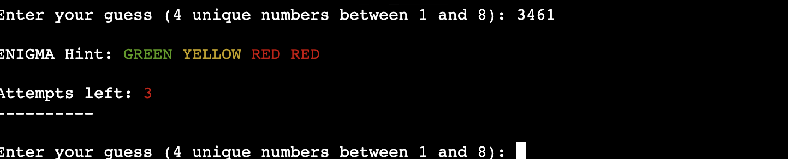
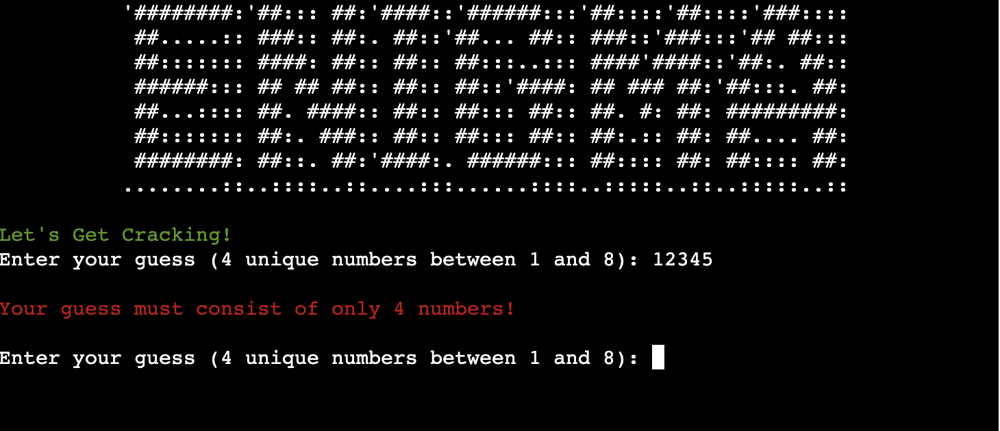

<h1 id="top"><a href="https://enigma-code-breaker.herokuapp.com/">ENIGMA CODE BREAKER</a></h1>

### Contents
<ul>
    <li>
        <a href="#introduction"><strong>Introduction</strong></a>
    </li>
    <li>
        <a href="#ux"><strong>UX</strong></a>               
    </li>
     <li>
        <a href="#features"><strong>Features</strong></a>
    </li>
    <li>
        <a href="#technologies"><strong>Technologies</strong></a>
    </li>
     <li>
        <a href="#testing"><strong>Development & Testing</strong></a>   
    </li>
    <li>
        <a href="#deployment"><strong>Deployment</strong></a>
    </li>
    <li>
       <a href="#credits"><strong>Credits</strong></a> 
    </li>
</ul>

<h2 id="introduction">Introduction</h2>

ENIGMA - Code Breaking Game, is a Python terminal game that runs on Heroku.

This is a simple python code breaking game losely based on the Master Mind game made by Mordecai Meirowitz in 1970. It's a single player versus the computer game. [Mastermind]( https://en.wikipedia.org/wiki/Mastermind_(board_game)).

### Demo
A live version of the game can be found <a href="https://enigma-code-breaker.herokuapp.com/">**HERE**</a>  
  
<a href="#top">Back to the top.</a>

### How To Play

ENIGMA gameplay, players try to crack the ENIGMA code randomly chosen by the computer. Players are given hints generated by the computer after every attempt to try to guess what the correct ENIGMA code is.  

* The ENIGMA code is 4 unique numbers between 1 - 8.

* The player has 10 attempts to guess the ENIGMA code.  The correct guess must be all 4 numbers in the correct order.

* After every attempt (unless you guess the ENIGMA code) the player is given a code hint. GREEN represents how many numbers were correct and in the correct position. YELLOW represents how many numbers were correct but not in the incorrect position & RED represents how many numbers are not in the ENIGMA code at all.  

* The ENIGMA hints of GREEN, YELLOW & RED do not match the order of the player's numbers in their guess.

>
>**For example:**
>
>       ENIGMA code is 1234
>
>       You guessed: 1356
>
>       ENIGMA hint will be: RED RED GREEN YELLOW
>
>       This represents 1 is GREEN and 3 is YELLOW and 5 & 6 are RED

<h2 id="ux">User Experience (UX)</h2>

<a href="#top">Back to the top.</a>

### User Stories

Target Audience – Anyone who wants to play a simple online command-line interface strategy game.

As a user I want to:
* understand how to play the game
* know how many attempts I have left
* know when I have entered something in an incorrect format and understand why
* have fun and be challenged
* have the choice to easily play again or quit

<h2 id="features">Features</h2>

<a href="#top">Back to the top.</a>

### Title Section:

* [Pyfiglet](https://www.geeksforgeeks.org/python-ascii-art-using-pyfiglet-module/#:~:text=pyfiglet%20takes%20ASCII%20text%20and,pyfiglet%20module%20%3A%20pip%20install%20pyfiglet) was installed and import pyfiglet was used to generate ASCII art for the title and subtitle of the game.

* The Figlet font banner3-D was used for the title of the game 

* For the subtitle the Figlet font used was digital.

* Text is run from left to right over the screen with the message "Guess all 4 numbers to crack the ENIGMA code!" utilising [sys-stdout](https://www.geeksforgeeks.org/sys-stdout-write-in-python/) and sleep to printout the letters as if it was a type writer.

<h2 id="future-features">Possible Future Features</h2>

* The ENIGMA game is a one-player versus the computer game but this game could be made into a 2 player game.  

* The ENIGMA game does not give the option to show high scores. This could be implemented using a Google Spreadsheet to store the number of attempts it took for each name entered. This scoreboard could then be displayed by printing the contents of it to the terminal.

* To make this game harder with different levels more numbers could be added to the ENIGMA code or fewer attempts given. 

<h2 id="technologies">Technologies</h2>

<a href="#top">Back to the top.</a>

Throughout the planning, design, testing and deployment of the ENIGMA game , I have used a number of technologies:

### Languages
<ol>
    <li><a href="https://en.wikipedia.org/wiki/HTML5" target="_blank">HTML</a>
        <ul><li>The main structure of the game container</li></ul>
    </li>
    <li><a href="https://en.wikipedia.org/wiki/JavaScript" target="_blank">JavaScript</a>
        <ul><li>Within the template supplied by code institute</li></ul>
    </li>
    <li><a href="https://en.wikipedia.org/wiki/Python_(programming_language)" target="_blank">Python</a>
        <ul><li>For the gameplay logic</li></ul>
    </li>
    <li><a href="https://www.markdownguide.org/" target="_blank">Markdown</a>
        <ul><li>For the content and structure of the README.md</li></ul>
    </li>
</ol>   

### Version Control
<ol>
    <li><a href="https://github.com/" target="_blank">Git & Github</a>
        <ul><li>For the hosting and version control of the game</li></ul>
    </li>
    <li><a href="https://www.gitpod.io/" target="_blank">Gitpod</a>
        <ul><li>The development environment used for writing the code for the game</li></ul>
    </li>
</ol>

### Applications    
<ol>
   <li><a href="https://lucid.app/" target="_blank">Lucid Chart</a>
        <ul><li>For the creation of the flowchart</li></ul>
    </li>
    <li><a href="https://visualstudio.microsoft.com/" target="_blank">Visual Studio (Desktop)</a>
        <ul><li>For testing out ideas without interfering with code for website</li></ul>
    </li>
    <li><a href="https://slack.com/intl/en-gb/" target="_blank">Slack (Desktop)</a>
        <ul><li>For communicating with peers and troubleshooting problems with the different environments used during the course and coding.</li></ul>
    </li>
</ol>
    
## Frameworks, Libraries and Programs

### os
The os library was imported to create a function to utilise the os.system to clear the terminal. 

### random
The random library was imported to access the built-in method of generating a random number selection using the randint() method. This then generates a random sequence of 4 numbers in a range of 1 – 8 for the ENIGMA code the user has to crack.

<ol> 
    <li><a href="https://docs.python.org/3/library/time.html">Python time library</a>
        <ul>Used to delay the next line of text in the python terminal</ul>
    </li>
    <li><a href="https://pypi.org/project/termcolor/">Python termcolor library</a>
        <ul>Used to add colour to the text in the python terminal</ul>
    </li>
    <li><a href="http://pep8online.com/checkresult" target="_blank">PEP8 ONLINE</a>
        <ul><li>To test and search for errors in the Python code</li></ul>
    </li>
    <li><a href="https://developers.google.com/web/tools/lighthouse" target="_blank">Lighthouse</a> Performance Tool
        <ul><li>To ensure high performance and quick loading times of the website</li></ul>
    </li>
</ol>  

<h2 id="testing">Development & Testing</h2>

<a href="#top">Back to the top.</a>

### Flow Chart

The flow of the game was laid out and structured to aid in the design of the control flow statements such as if-elif-else statements, while loops and for loops. This also allowed the design of the user input validation checks to be visually clear before the code was written. This was created in [Lucid Chart]( https://lucid.app/).

  

### Testing

*   Methods such as print() as the code developed was used to check for errors. This helped check everything was behaving as expected and functions such as generating the random numbers for the ENIGMA code were being generated correctly.  

*   Any user inputs were printed back to the console to check and test all functions and methods were correctly applied to the input.  

*   Errors or warnings were fixed as they appeared such as indentation errors, lines too long or extra space issues. No errors are reported now.

*   After deployment all features were checked on a laptop, mobile (iPhone 13). The website was checked on Chrome, Firefox and Edge.

*   The game was deployed early on in development and checked regularly to ensure game flow and any errors pn Heroku were handled .

*   Testing inputs were used to ensure user inputs would be handled correctly and appropriate feedback to the user was shown on screen. 

    * User Name:
    This will accept letters and numbers but cannot be blank or just numbers, the space key was pressed and also just numbers entered to ensure the errors was caught and handled appropriately.

    * Player Choice:
    To test capital and small H and X were typed in and also other random inputs such as spaces, other letters, words or numbers to ensure error caught and handled appropriately.

    * Player Guess:
    As this will only accept 4 numbers between 1-8, many other combinations of input were tested.  For example, more or fewer numbers were entered, numbers less than 1 or greater than 8 were entered.  Random special characters and blank entry were all tested to ensure errors were caught and handled appropriately. Error message regarding the different errors are returned to the player.

    * ENIGMA Code Hint:
    The ENIGMA code was printed to the terminal during development to help with testing the code hint generated matched the player's guesses.  It was checked to ensure numbers in the correct position generated a GREEN hint, numbers in incorrect position generated a YELLOW hint and numbers not in the ENIGMA code at all generated a RED hint.

    * Attempts Left:
    Attempts left was checked by playing the game through to see if attempts left decreased by 1 each time and also that attempts left did not change if an input error was entered.

    * Game Won / Game Lost
    The game was tested on winning and losing to ensure the correct messages were displayed for both.

    * Play Again
    To play again the user can type Y or N. This was tested for lower and uppercase Y and N to check both worked. Other inputs such as numbers, random words or letters and the enter key pressed were all checked to ensure the errors were handled correctly and error message regarding the different errors are returned to the player.

### Username Input Section:

* A message to the user to enter their name is seen first. This alerts the user on how to start playing the game.

  

* If the user enters a blank space or enters only numbers as the username an error will be shown with info on the error

  

* After the user enters a correct username this is returned in green with a welcome message

  

### Game Help Section:

* The user is then presented with 2 options, view the help screen by entering H or play game by entering P

  

* If anything is entered except P or H an error will be displayed to the user

  

* If H is entered the help screen comes in view explaining how to play the ENIGMA game

* At the bottom of this screen there are 2 options, enter P to play the game or X to exit the help screen

  

### Game Play Section:

* If P is entered the ENIGMA game will start with the initial player guess request printed to the terminal

  

* Once the player has entered a vaild guess the code is evaulated against the ENIGMA code to see if any of the numbers match

* If any of the numbers match a hint will be shown to the user to indicate if it's either in the ENIGMA code and if it's in the correct postion by using the colour codes  
GREEN: One of the numbers is in the ENIGMA code and in the correct position  
YELLOW: One of the numbers is in the ENIGMA code but is not in the correct position  
RED: One of the numbers is not in the ENIGMA code at all  

  

* If the user enters a blank space or a letters as the guess an error will be shown explaining why it's not a vaild guess 

  

* If the user enters more than 4 numbers as the guess an error will be shown explaining why it's not a vaild guess 

  

* If the user is good enough to crack the ENIGMA code you will be presented with the WIN screen 

* At the bottom of the screen there is an option to play a new game by entering Y or exit the game by entering N

  

* If the users attempts reach 0 then the  lose screen will be presented and the ENGIMA code will be revealed

* At the bottom of the screen there is an option to play a new game by entering Y or exit the game by entering N

  

* Should the user select to exit the game a goodbye message is displayed and the game is quit

  

## Issues solved during development

## ENIGMA hint colours

I had an issue when using termcolor for the ENIGMA hint colour words GREEN, YELLOW & RED.

After a few Google searches I found that lists don't have a concept of colour in Python.

To be able do this 3 new lists were made, 1 for GREEN return_list_green, 1 for Yellow return_list_yellow and 1 for RED return_list_red. Then append and join the 3 lists in to one. Each item in the list is looped through so termcolor works on print and can add the individual colors to the items in the return_list.

>**Join lists:**
>
>       # join the 3 seperate lists for printing colour hints with termcolor
>        return_list = (
>            ' '.join(str(item) for item in return_list_green)) + (' ') + (
>                ' '.join(str(item) for item in return_list_yellow)) + (' ') + (
>                ' '.join(str(item) for item in return_list_red))
>        print("\nENIGMA Hint: " + return_list)
>        return self.check_win(return_list)

## Player Guess validation

To validate the players guess and make sure that only 4 numbers between 1- 8 where used as the guess I had to validate the players guess utilising 3 different methods and then returning the validated guess:

**Validate the players guess:**

>       # join the 3 seperate lists for printing colour hints with termcolor
>       #number_issue: this was used to validate if the numbers entered were between 1 and 8
>
>        if int(number) < 1 or int(number) > 8:
>                       number_issue = True
>
>        #unique_issue: this was used to validate if the numbers entered were unique and not duplicated
>
>        if player_guess.count(number) > 1:
>                        unique_issue = True
>
>        #length_issue: this was used to validate if the numbers entered are exactly 4 numbers not more or less
>
>        if len(player_guess) != 4:
>                        length_issue = True

## Validator Testing

* <a href="http://pep8online.com" target="_blank">PEP8 ONLINE</a> was used for validating the python files. All python files were checked with no errors reported.

* <a href="https://developers.google.com/web/tools/lighthouse" target="_blank">Lighthouse</a> Performance Tool

  

<h2 id="deployment">Deployment</h2>

<a href="#top">Back to the top.</a>

### This project was created on GitHub and Edited in GitPod by carrying out the following:

<ol>
    <li>A new repository was created using 'Code-Instutute-Org/python-essentials-template'</li>
    <li>A meaningful name was given to my new repository and I selected 'Create Repository'</li>
    <li>I then opened the repository on GitHub and clicked the 'Gitpod' button to build the GitPod workspace which would allow me to build and edit the code used to make the <em>Star Trek Time Loop</em> website/game</li>
    <li>Version control was used throughout the project using the following commands in the terminal using Bash
        <ul>
            <li>git add . <strong>OR</strong> git add "file name" - to stage the changes and get them ready for being committed to the local repo.</li> 
            <li>git commit -m "Description of the update" - to save the change and commit the change to the local repo</li>
            <li>git push - to push all committed changes to the GitHub</li>
            <li>commit --amend - for changing the wording or spelling of the most recent commit</li>
            <li>git reset "commit hash" </li>
            <li>git push -f - This was used to force changes through to the GitHub repo if either "commit --amend" or "git reset" were used</li>
        </ul>
    </li>

### Heroku

The project was deployed via [Heroku]( https://id.heroku.com/login), and the live link can be found here: [ENIGMA – Code Breaker](https://enigma-code-breaker.herokuapp.com/) 

This project was developed utilising the [Code Institute Template]( https://github.com/Code-Institute-Org/python-essentials-template).  Some of the deployment steps below are specifically required for the new CI template and may not be applicable to older versions, or different projects.

Before deploying to Heroku pip3 freeze > requirements.txt was used to add pyfiglet and termcolor imports for deployment.

This project was deployed to Heroku using the Heroku CLI details below

* Login
To use the CLI you must log in to your Heroku account. To do this you will need to
enter the command heroku login -i in the terminal. It requires the email and
password you used to sign up. If you have enabled multi-factor authentication (a
recommended security practice) then instead of your password you need an API key.
To get the API key go to your account settings and scroll down to the section ‘API
Key’. Click reveal and copy that, then paste it into the password prompt.

  

* Creating A Heroku App
Now that you are logged in, the first thing is to create a new app. Heroku creates a
URL based on your app name, so it must be unique not only on your account, but
across the whole site. You may need to try a few different names. To create an app
use the following command, where myapp is the name of your app.

  

* Here the app heroku-cli-example has been created with an output of the website
URL. It also displays and sets the git remote repository which will be used to deploy.
By default the region will be set to the US. If you would prefer a server based in the
EU then you can specify the region with the flag EU

* Packages
* When you push code to Heroku it will look at the repository contents to decide how
to build the project. One of the factors taken into consideration is the package file.
With a Python project the standard file is a requirements.txt file, which will have the
list of packages needed to run the project. If this file is present it will build the project
using the Python buildpack.
  
* It is also possible to specify the buildpack manually. More information about
buildpacks can be found in the documentation. To check the buildpack for the
project you can enter heroku buildpacks in the terminal.

* Click either **Enable Automatic Deploys** for automatic deployment when you push updates to Github.

* Select the correct branch for deployment from the drop-down menu and click **Deploy Branch** for manual deployment.

### Github Local Deployment
There are many ways to deploy the project locally on your own device. Forking, Cloning, GitHub Desktop and Zip Exctraction, the steps in these processes are outlined below:

#### Forking the GitHub repo
If you want to make changes to the repo without affecting it, you can make a copy of it by 'Forking' it. This will make sure that the original repo remains unchanged.

<ol>
    <li>Log in to your GitHub account</li>
    <li>Navigate to the repository <a href="https://github.com/artcuddy/project3-enigma"><strong>HERE</strong></a></li>
    <li>Select the 'Fork' button in the top right corner of the page (under your account image)</li>
    <li>The repo has now been copied into your own repos and you can work on it in your chosen IDE</li>
    <li>If you have any suggestions to make regards to the code to make the site better, you can put in a pull request</li>
</ol>

#### Cloning the repo with GitPod
<ol>
    <li>Log in to your GitHub account</li>
    <li>Navigate to the Repository <a href="https://github.com/artcuddy/project3-enigma"><strong>HERE</strong></a></li>
    <li>Select the 'Code' button above the file list on the right had side</li>
    <li>Ensure HTTPS is selected and click the clipboard on the right of the URL to copy it</li>
    <li>Open a new workspace in GitPod</li>
    <li>In the bash terminal type 'git clone [copy url here from step 4]'</li>
    <li>Press enter - the IDE will clone and download the repo</li>
</ol>

#### Github Desktop
<ol>
    <li>Log in to your GitHub account</li>
    <li>Navigate to the Repository <a href="https://github.com/artcuddy/project3-enigma"><strong>HERE</strong></a></li>
    <li>Select the 'Code' button above the file list on the right had side</li>
    <li>Select 'Open with GitHub Desktop'</li>
    <li>If you haven't already installed GitHub desktop application - you will need to follow the relevant steps to do this</li>
    <li>The repo will then be copied locally onto your machine</li>
</ol>

#### Download and extract the zip directly from GitHub
<ol>
    <li>Log in to your GitHub account</li>
    <li>Navigate to the Repository <a href="https://github.com/artcuddy/project3-enigma"><strong>HERE</strong></a></li>
    <li>Select the 'Code' button above the file list on the right had side</li>
    <li>Select 'Download Zip'</li>
    <li>Once you have the Zip downloaded, open it with your prefered file decompression software</li>
    <li>You can then drag and drop the files from the folder into your chosen IDE or view/edit them on your local machine</li>
    <li>If you want to create a web-app from the repo please follow the instructions in "Project Deployment"</li>
</ol>

<h2 id="credits">Credits</h2>

<a href="#top">Back to the top.</a>

I have listed some of the resources I used for inspiration and in researching how to create the ENIGMA Codebreaker Game

* Mastermind Game with Python: Tutorial: <a href="https://developers.google.com/web/tools/lighthouse" target="_blank">Youtube</a>

* Mastermind Mini Project by: <a href="https://github.com/monicode/Python-Mini-Projects/blob/master/mastermind%20colors.py" target="_blank">Monicode</a>

* Instructables <a href="https://www.instructables.com/Python-Mastermind-Game/" target="_blank">Python Mastermind Game</a>

* Create a Mastermind Game <a href="https://www.askpython.com/python/examples/create-mastermind-game-in-python" target="_blank">Ask Python</a>

* Mastermind in Python <a href="https://www.ddtechblog.com/Mastermind-in-python" target="_blank">DDTECHBLOG</a>

These resources helped me solve some of the issues encountered when developing the game

* How to use Pyfiglet to display the game Heading & Subheading <a href="https://www.geeksforgeeks.org/python-ascii-art-using-pyfiglet-module/" target="_blank">Pyfiglet</a>

* Termcolor ANSII Color formatting for output in terminal: <a href="https://pypi.org/project/termcolor/" target="_blank">Termcolor</a>

* Difference between staticmethond & classmethod: <a href="https://stackoverflow.com/questions/136097/difference-between-staticmethod-and-classmethod/1669524#1669524" target="_blank">Stack Overflow</a>

* Python classes: <a href="https://www.programiz.com/python-programming/class" target="_blank">Programiz</a>

<a href="#top">Back to the top.</a>

<h2 id="acknowledgements">Acknowledgements</h2>

This project was made possible due to the help & advice from my Mentor Rohit and all the Code Institute Slack community, extensive Googling and the Stack Overflow community.

